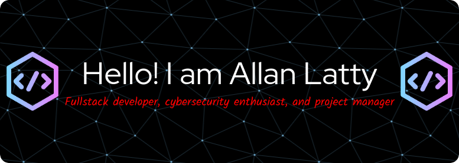

<h1 align="center">

<!-- -->

</h1>

<h3 align="center">Connect With Me</h3>

  
  
  

- 🌱 I’m currently working and learning **REACT web development.**

- 📝 I regularly write articles on [https://medium.com/@AGL745](https://medium.com/@AGL745)

- 💬 Ask me about **web development, cybersecurity and Ada**

- 📫 How to reach me **allan.g.latty@gmail.com**

- 📄 Know about my experiences [https://www.linkedin.com/in/allan-latty-9427a441/](https://www.linkedin.com/in/allan-latty-9427a441/)

# 📊 GitHub Stats:

 
 

 

<h3 align="left">Connect with me:</h3>

 

<h3 align="left"># 💻 Technologies::</h3>

                   

                                    

<!--     
    <!-- 
   
    -->
